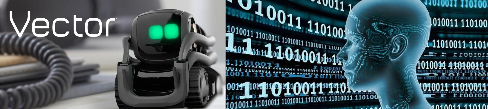

## Zusammenfassung

> Dieses Projekt verfolgt das Ziel, einen Roboter auf einer kreisförmigen Strecke ein Rennen gegen andere Roboter fahren zu lassen. Die Strecke, gekennzeichnet durch Checkpoints, soll vom Roboter korrekt visuell erkannt und robust abgefahren werden. Für die Erkennung dieser verwenden wir das Echtzeit-Objekterkennungssystem YOLOv5. Dieser Ansatz stellt sich für uns als vorteilhaft heraus, da die Objekterkennung sehr schnell und zuverlässig funktioniert. Für die Fortbewegung des Roboters bauen wir eine eigene Driving-Funktion. Die absoluten Koordinaten der erkannten Checkpoints werden relativ zum Sichtfeld des Roboters abgeglichen. Wenn der erkannte Checkpoint sich auf dem linken Teil des Sichtfeldes befindet, so fährt er nach links. Gleiches gilt für Rechts. Die Fahrtrichtung wird dabei über 10 mal die Sekunde angepasst. Das Fahrverhalten wird mit sinnvollen Funktionen optimiert und feinjustiert, sodass ein flüssiger Fahrverlauf entsteht. Eine Hilfsfunktion garantiert, dass der Roboter im Falle des Nichterkennens eines Checkpoints autonom den nächsten ausfindig macht und anfährt. Diese Driving-Funktionen führen zu einem sicheren und robusten Fahrverhalten. Mit diesem Ansatz minimieren wir die Fehlentscheidungen des Roboters und garantieren zudem ein schnelles sowie solides Abfahren der Rennstrecke.

# Vector Race

**Autoren:** Tim Cramer, Vito Völker und Jan Dorn

Dieses Projekt kann gut in zwei große Bereiche aufgeteilt werden.

- Objekterkennung mit Yolov5 (**Wo** muss Vector hin?)
- Wegfinundung des Roboters (**Wie** kommt Vector dort hin?)

# Objekterkennung mit Yolov5

Das YOLO Framework (You only look once) ist ein modernes Echtzeit-Objekterkennungssystem. Richtig angewendet ist es sehr schnell und sehr genau. Wir haben anhand 800+ Bilder der 6 verschiedenen Codes der Checkpoints das neuronale Netz auf die Erkennung dieser trainiert (6h+ auf einer Google GPU). So wendet ihr das an:

1.  Die [yolov5](https://github.com/ultralytics/yolov5) repository lokal clonen und in den Ordner rein

        git clone https://github.com/ultralytics/yolov5
        cd yolov5

2.  Dann alle Abhängigkeiten installieren

        pip install -qr requirements.txt

3.  Unser fertig trainiertes Modell (best.pt) für die Checkpointerkennung in den yolov5 Ordner packen. Dieses liegt im [Model](Model/CheckpointModel) Ordner.

4.  Mit der detect.py file kann die Objekterkennung auf die Webcam, einem Bild oder einem Video angewendet werden.

        python detect.py --source 0 --weights best.pt
                                  img.jpg
                                  vid.mp4
                                  https://www.youtube.com/watch?v=dQw4w9WgXcQ

5.  Mit einem Script können wir den Video Feed des Vectors dieser yolov5 Objekterkennung füttern.

# Wegfindung des Roboters

Unsere Tests haben ergeben, dass die `go_to_pose()` Funktion leider nicht robust genug für unsere Anforderungen ist. Wir können uns beim Rennen schlicht nicht erlauben die Tore ungenau anzufahren. Falls Vector gerammt wird, verschiebt sich sein Koordinatensystem und er fährt mit dieser Funktion nicht zum Checkpoint. Falls Vector irgendein Objekt falsch als Hindernis interpretiert, wird er mit dieser Funktion versuchen dieses fälschlicherweise zu umfahren. Wir bauen also eine eigene Funktion, die mehrmals in der Sekunde sicherstellen wird, dass Vector auf richtigem Kurs ist.
Im Ordner [Vectorrace](Vectorrace) sind die zugehörigen Skripte zu finden.

Prinzipiell verhält sich Vector wie folgt: Durch das trainierte Modell ist Vector in der Lage die Checkpoints zu erkennen, die er schlussendlich auch durchfahren soll. Vector nimmt ein Bild auf und bekommt durch YOLOv5 das Array mit den vorher beschriebenen Informationen. Darüber hinaus wissen wir, dass das Bild 640\*360 Pixel breit ist und die Mittellinie des Sichtfeldes somit bei 320 Pixeln liegt. Wenn der Mittelpunkt der Bounding Box rechts der Mitte liegt, soll er rechts fahren und falls er links davon liegt spiegelverkehrt. Je weiter entfernt der Checkpoint von der Mittellinie des Bildes liegt, desto stärker wird eingelenkt.

Wird gar kein Checkpoint erkannt, wird gebrauch einer Driving-Hilfsfunktion gemacht, deren Aufgabe es ist, einen nächsten Checkpoint ausfindig zu machen.

## Pseudocode

Folgender Pseudocode soll aufzeigen, wie unser Code im groben Funktioniert.

        while True:
                take_image() #Vector schießt ein Bild und speichert es ab

                inference_image() #YOLOv5 Modell benutzen um Checkpoints zu erkennen

                frame = inference_image().pandas #Speichert die Koordinaten Checkpoints ab in einem Pandas Dataframe

                if(!frame.isEmpty): #Es wurde mindestens ein Checkpoint erkannt

                        getCoordinates() #Extrahiere Koordinaten des Checkpoints relativ zum Bild

                        calcSteeringIntensity() #Berechne wie stark eingelenkt werden soll und in welche Richtung

                        drive() #Fährt zum Checkpoint, ausgehend von Koordinaten und Einlenkstärke

                else: #Es wurde kein Checkpoint erkannt

                        look_around() #Nutzen der Hilfsfunktion um den nächsten Ceckpoint zu finden
